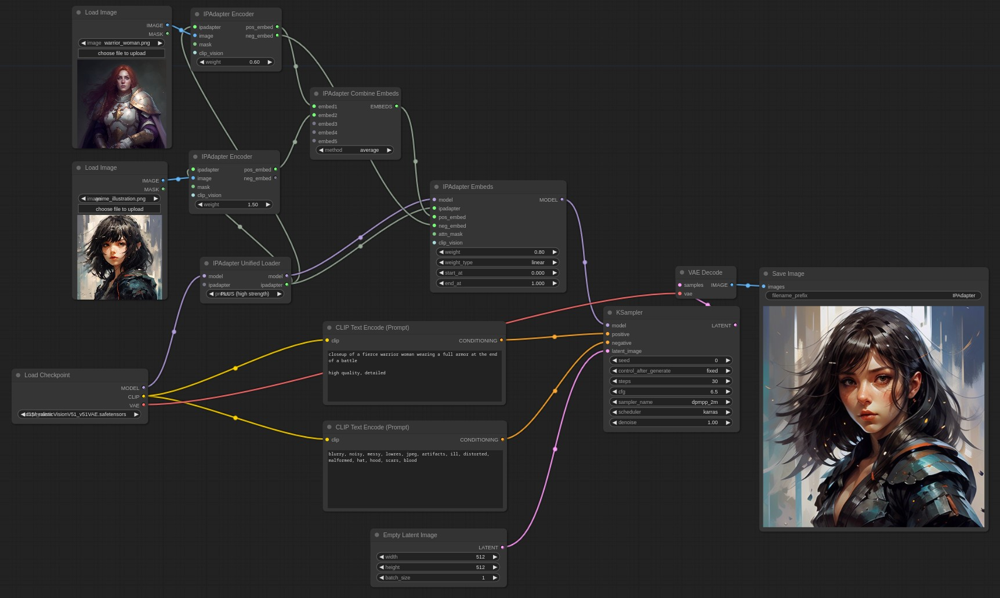

# ComfyUI IPAdapter plus
[ComfyUI](https://github.com/comfyanonymous/ComfyUI) reference implementation for [IPAdapter](https://github.com/tencent-ailab/IP-Adapter/) models.

IPAdapter implementation that follows the ComfyUI way of doing things. The code is memory efficient, fast, and shouldn't break with Comfy updates.

# Open source for you but not free for me...

I started working on IPAdapter because I needed it for my work. As the project evolved I'm inevitably receiving feature requests, bug reports and support requests.

I'm an open source advocate and I'm happy to share all my code for free but maintaining the IPAdapter, the [Essentials](https://github.com/cubiq/ComfyUI_essentials), [InstantID](https://github.com/cubiq/ComfyUI_InstantID) and [Face Analysis](https://github.com/cubiq/ComfyUI_FaceAnalysis) takes time.

**I'm not expecting donations but if you are making a profit from my projects it is only fair that you give something back.** I'm talking especially to companies here, I know the struggles of being a freelancer.

Please contact me if you are interested in a sponsorship at _matt3o@gmail_ or consider a contribution via [PayPal](https://paypal.me/matt3o) (Matteo "matt3o" Spinelli, Firenze, IT). That will help maintaining the code, adding new features and working on better documentation.

And in that regard I really need to thank [Nathan Shipley](https://www.nathanshipley.com/) for his generous donation. Go check his website, he's terribly talented.

## :warning: IPAdapter V2: complete Code rewrite warning

A code cleanup was long overdue and with the occasion I also added a few new important features. The code should be faster and should take less resources but with such an important code rewrite it's inevitable to have introduced some new bugs.

**At the moment I'm releasing this completely undocumented!** I will post better documentation and video tutorials in the coming days. In the meantime you can check the `example` directory for most of the old and new features.

## Important updates

**2024/03/23**: Complete code rewrite!. **This is a breaking update!** Your previous workflows won't work and you'll need to recreate them. You've been warned! After the update, refresh your browser, delete the old IPAdapter nodes and create the new ones.

**2024/02/02**: Added experimental [tiled IPAdapter](#tiled-ipadapter). It lets you easily handle reference images that are not square. Can be useful for upscaling.

**2024/01/19**: Support for FaceID Portrait models.

**2024/01/16**: Notably increased quality of FaceID Plus/v2 models. Check the [comparison](https://github.com/cubiq/ComfyUI_IPAdapter_plus/issues/195) of all face models.

*(previous updates removed for better readability)*

## What is it?

The IPAdapter are very powerful models for image-to-image conditioning. Given one or more reference images you can do variations augmented by text prompt, controlnets and masks. Think of it as a 1-image lora.

## Example workflow

The [example directory](./examples/) has many workflows that cover all IPAdapter functionalities.

## Video Tutorials

**:star: [New IPAdapter features](https://youtu.be/_JzDcgKgghY)**

The following videos are about the previous version of IPAdapter, but they still contain valuable information.

**:nerd_face: [Basic usage video](https://youtu.be/7m9ZZFU3HWo)**

**:rocket: [Advanced features video](https://www.youtube.com/watch?v=mJQ62ly7jrg)**

**:japanese_goblin: [Attention Masking video](https://www.youtube.com/watch?v=vqG1VXKteQg)**

**:movie_camera: [Animation Features video](https://www.youtube.com/watch?v=ddYbhv3WgWw)**

## Installation

Download or git clone this repository inside `ComfyUI/custom_nodes/` directory or use the Manager. Beware that the automatic update of the manager sometimes doesn't work and you may need to upgrade manually.

IPAdapter always requires the latest version of ComfyUI. If something doesn't work be sure to upgrade!

There's now an *Unified Model Loader*, for it to work you need to name the files exactly how it is described below.

The pre-trained models are available on [huggingface](https://huggingface.co/h94/IP-Adapter), download and place them in the `ComfyUI/models/ipadapter` directory (create it if not present). You can also use any custom location setting an `ipadapter` entry in the `extra_model_paths.yaml` file.

IPAdapter also needs the image encoders. You need the [CLIP-ViT-H-14-laion2B-s32B-b79K.safetensors](https://huggingface.co/h94/IP-Adapter/resolve/main/models/image_encoder/model.safetensors) and [CLIP-ViT-bigG-14-laion2B-39B-b160k.safetensors](https://huggingface.co/h94/IP-Adapter/resolve/main/sdxl_models/image_encoder/model.safetensors) image encoders, you may already have them. If you don't, download them but **be careful because the file name is the same for both!** Rename them and place them in the `ComfyUI/models/clip_vision/` directory.

The following table shows the combination of Checkpoint and Image encoder to use for each IPAdapter Model. Any Tensor size mismatch you may get it is likely caused by a wrong combination.

| SD v. | IPadapter | Img encoder | Notes |
|---|---|---|---|
| v1.5 | [ip-adapter_sd15](https://huggingface.co/h94/IP-Adapter/resolve/main/models/ip-adapter_sd15.safetensors) | ViT-H | Basic model, average strength |
| v1.5 | [ip-adapter_sd15_light](https://huggingface.co/h94/IP-Adapter/resolve/main/models/ip-adapter_sd15_light.safetensors) | ViT-H | Light model, very light impact |
| v1.5 | [ip-adapter_sd15_light_v11](https://huggingface.co/h94/IP-Adapter/resolve/main/models/ip-adapter_sd15_light_v11.bin) | ViT-H | Updated light model |
| v1.5 | [ip-adapter-plus_sd15](https://huggingface.co/h94/IP-Adapter/resolve/main/models/ip-adapter-plus_sd15.safetensors) | ViT-H | Plus model, very strong |
| v1.5 | [ip-adapter-plus-face_sd15](https://huggingface.co/h94/IP-Adapter/resolve/main/models/ip-adapter-plus-face_sd15.safetensors) | ViT-H | Face model, use only for faces |
| v1.5 | [ip-adapter-full-face_sd15](https://huggingface.co/h94/IP-Adapter/resolve/main/models/ip-adapter-full-face_sd15.safetensors) | ViT-H | Stronger face model, not necessarily better |
| v1.5 | [ip-adapter_sd15_vit-G](https://huggingface.co/h94/IP-Adapter/resolve/main/models/ip-adapter_sd15_vit-G.safetensors) | ViT-bigG | Base model trained with a bigG encoder |
| SDXL | [ip-adapter_sdxl](https://huggingface.co/h94/IP-Adapter/resolve/main/sdxl_models/ip-adapter_sdxl.safetensors) | ViT-bigG | Base SDXL model, mostly deprecated |
| SDXL | [ip-adapter_sdxl_vit-h](https://huggingface.co/h94/IP-Adapter/resolve/main/sdxl_models/ip-adapter_sdxl_vit-h.safetensors) | ViT-H | New base SDXL model |
| SDXL | [ip-adapter-plus_sdxl_vit-h](https://huggingface.co/h94/IP-Adapter/resolve/main/sdxl_models/ip-adapter-plus_sdxl_vit-h.safetensors) | ViT-H | SDXL plus model, stronger |
| SDXL | [ip-adapter-plus-face_sdxl_vit-h](https://huggingface.co/h94/IP-Adapter/resolve/main/sdxl_models/ip-adapter-plus-face_sdxl_vit-h.safetensors) | ViT-H | SDXL face model |

**FaceID** requires `insightface`, you need to install them in your ComfyUI environment. Check [this issue](https://github.com/cubiq/ComfyUI_IPAdapter_plus/issues/162) for help.

When the dependencies are satisfied you need:

| SD v. | IPadapter | Img encoder | Lora |
|---|---|---|---|
| v1.5 | [FaceID](https://huggingface.co/h94/IP-Adapter-FaceID/resolve/main/ip-adapter-faceid_sd15.bin) | (not used¹) | [FaceID Lora](https://huggingface.co/h94/IP-Adapter-FaceID/resolve/main/ip-adapter-faceid_sd15_lora.safetensors) |
| v1.5 | [FaceID Plus](https://huggingface.co/h94/IP-Adapter-FaceID/resolve/main/ip-adapter-faceid-plus_sd15.bin) | ViT-H | [FaceID Plus Lora](https://huggingface.co/h94/IP-Adapter-FaceID/resolve/main/ip-adapter-faceid-plus_sd15_lora.safetensors) |
| v1.5 | [FaceID Plus v2](https://huggingface.co/h94/IP-Adapter-FaceID/resolve/main/ip-adapter-faceid-plusv2_sd15.bin) | ViT-H | [FaceID Plus v2 Lora](https://huggingface.co/h94/IP-Adapter-FaceID/resolve/main/ip-adapter-faceid-plusv2_sd15_lora.safetensors) |
| v1.5 | [FaceID Portrait](https://huggingface.co/h94/IP-Adapter-FaceID/resolve/main/ip-adapter-faceid-portrait_sd15.bin) | (not used¹)| not needed |
| SDXL | [FaceID](https://huggingface.co/h94/IP-Adapter-FaceID/resolve/main/ip-adapter-faceid_sdxl.bin) | (not used¹) | [FaceID SDXL Lora](https://huggingface.co/h94/IP-Adapter-FaceID/resolve/main/ip-adapter-faceid_sdxl_lora.safetensors) |
| SDXL | [FaceID Plus v2](https://huggingface.co/h94/IP-Adapter-FaceID/resolve/main/ip-adapter-faceid-plusv2_sdxl.bin) | ViT-H | [FaceID SDXL Lora](https://huggingface.co/h94/IP-Adapter-FaceID/resolve/main/ip-adapter-faceid-plusv2_sdxl_lora.safetensors) |

¹ The base FaceID model doesn't make use of a CLIP vision encoder. Remember to pair any FaceID model together with any other Face model to make it more effective.

The loras need to be placed into `ComfyUI/models/loras/` directory.

## Generic suggestions

There's a basic workflow included in this repo and a few examples in the [examples](./examples/) directory. Usually it's a good idea to lower the `weight` to at least `0.8` and increase the steps a little.

## Documentation soon to come...

Working on it!

## Troubleshooting

Please check the [troubleshooting](https://github.com/cubiq/ComfyUI_IPAdapter_plus/issues/108) before posting a new issue. Alse remember to check the previous closed issues.

## Credits

- [IPAdapter](https://github.com/tencent-ailab/IP-Adapter/)
- [ComfyUI](https://github.com/comfyanonymous/ComfyUI)
- [laksjdjf](https://github.com/laksjdjf/IPAdapter-ComfyUI/)
