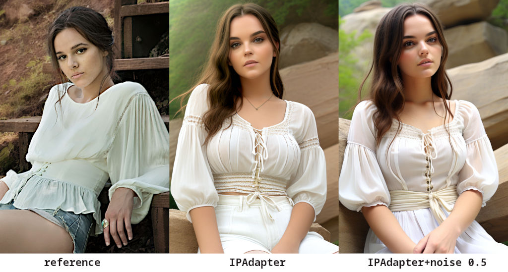
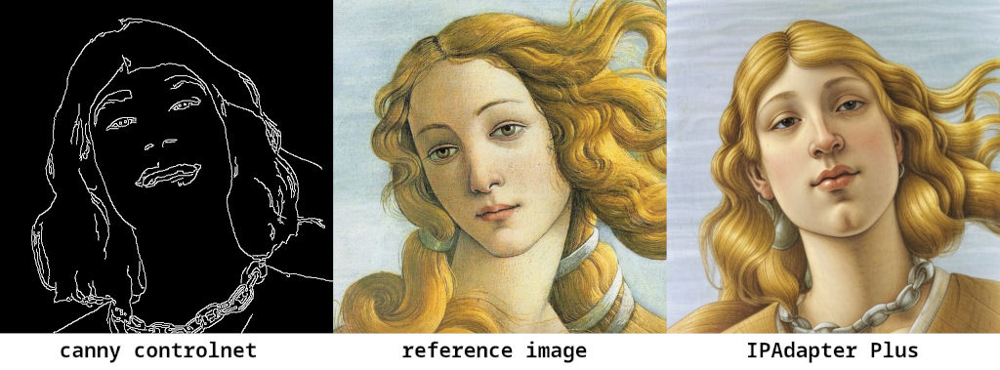
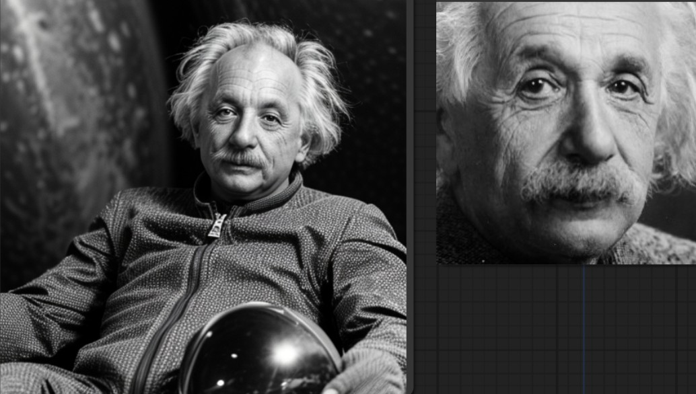
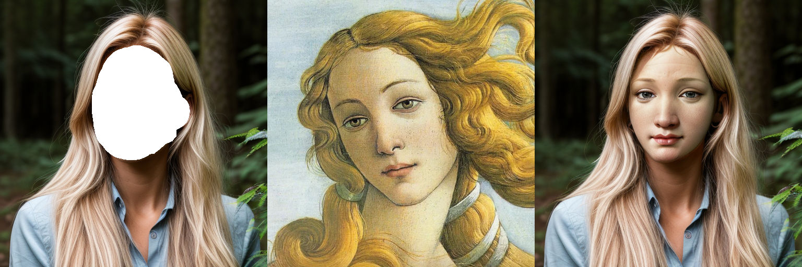
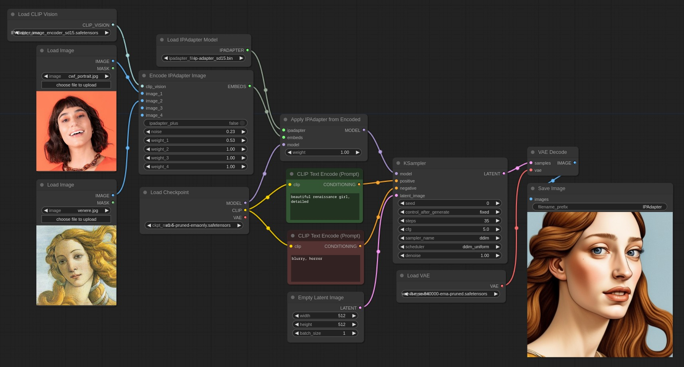
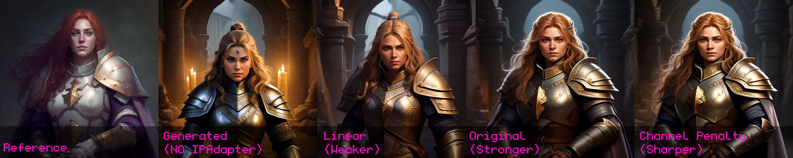
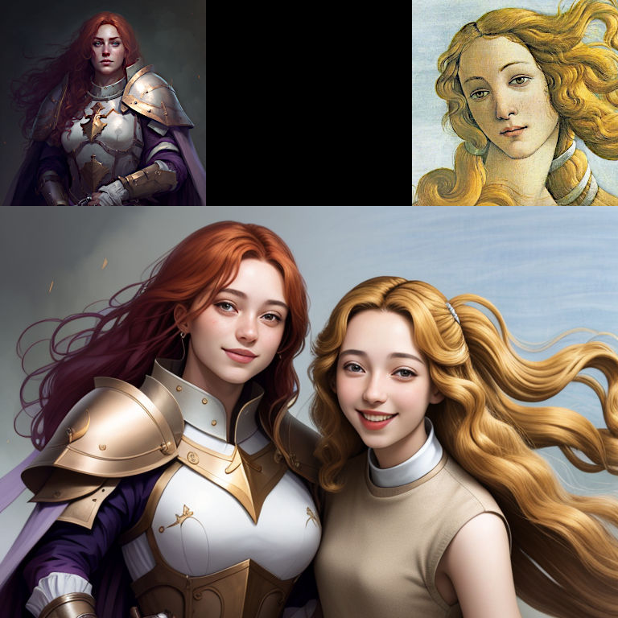
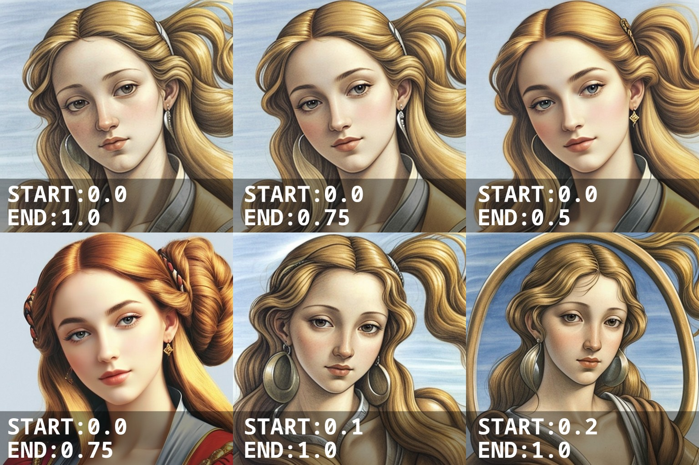
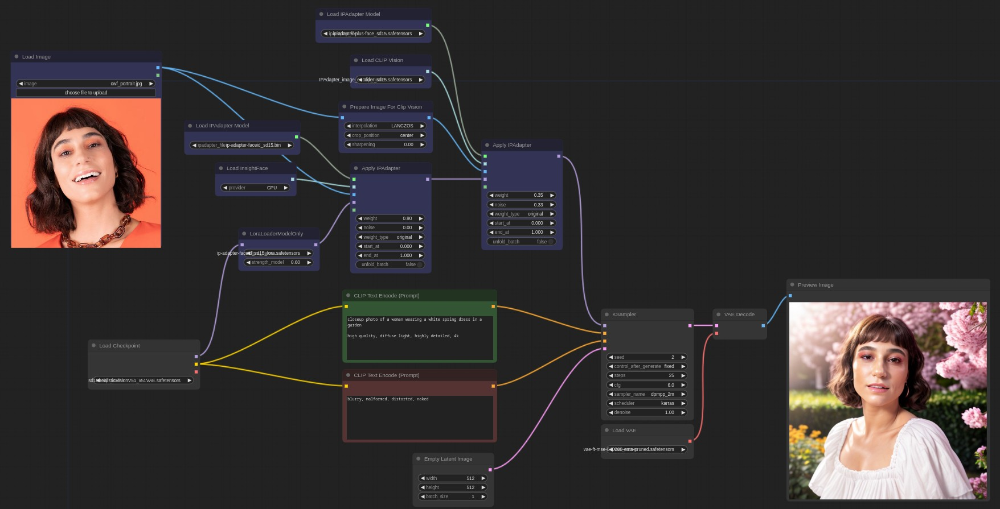

# ComfyUI IPAdapter plus
[ComfyUI](https://github.com/comfyanonymous/ComfyUI) reference implementation for [IPAdapter](https://github.com/tencent-ailab/IP-Adapter/) models.

IPAdapter implementation that follows the ComfyUI way of doing things. The code is memory efficient, fast, and shouldn't break with Comfy updates.

## Important updates

**2023/12/30**: Added support for FaceID Plus v2 models. **Important:** this update again breaks the previous implementation. This time I had to make a new node just for FaceID. The base `IPAdapter Apply` node will work with all previous models; for all FaceID models you'll find an `IPAdapter Apply FaceID` node. **When using v2 remember to check the `v2` options otherwise it won't work as expected!** As always the examples directory is full of workflows for you to play with.

**2023/12/28**: Added support for FaceID Plus models. **Important:** this update breaks the previous implementation of FaceID. Check the updated workflows in the example directory! Remember to refresh the browser ComfyUI page to clear up the local cache.

**2023/12/22**: Added support for FaceID models. [Read the documentation](#faceid) for details.

**2023/12/05**: Added `batch embeds` node. This lets you encode images in batches and merge them together into an `IPAdapter Apply Encoded` node. Useful mostly for animations because the clip vision encoder takes a lot of VRAM. My suggestion is to split the animation in batches of about 120 frames.

**2023/11/29**: Added `unfold_batch` option to send the reference images sequentially to a latent batch. Useful for animations.

**2023/11/26**: Added [timestepping](#timestepping). You may need to delete the old nodes and recreate them. **Important:** For this to work you need to update ComfyUI to the latest version.

**2023/11/24**: Support for multiple attention masks.

**2023/11/23**: Small but important update: the new default location for the IPAdapter models is `ComfyUI/models/ipadapter`. **No panic**: the legacy `ComfyUI/custom_nodes/ComfyUI_IPAdapter_plus/models` location still works and nothing will break.

**2023/11/08**: Added [attention masking](#attention-masking).

*(previous updates removed for better readability)*

## What is it?

The IPAdapter are very powerful models for image-to-image conditioning. Given a reference image you can do variations augmented by text prompt, controlnets and masks. Think of it as a 1-image lora.

## Example workflow

The [example directory](./examples/) has many workflows that cover all IPAdapter functionalities.

## Video Tutorials

**:nerd_face: [Basic usage video](https://youtu.be/7m9ZZFU3HWo)**

**:rocket: [Advanced features video](https://www.youtube.com/watch?v=mJQ62ly7jrg)**

**:japanese_goblin: [Attention Masking video](https://www.youtube.com/watch?v=vqG1VXKteQg)**

**:movie_camera: [Animation Features video](https://www.youtube.com/watch?v=ddYbhv3WgWw)**

## Installation

Download or git clone this repository inside `ComfyUI/custom_nodes/` directory or use the Manager. Beware that the automatic update of the manager sometimes doesn't work and you may need to upgrade manually.

The pre-trained models are available on [huggingface](https://huggingface.co/h94/IP-Adapter), download and place them in the `ComfyUI/models/ipadapter` directory (create it if not present). You can also use any custom location setting an `ipadapter` entry in the `extra_model_paths.yaml` file.

IPAdapter also needs the image encoders. You need the [CLIP-**ViT-H**-14-laion2B-s32B-b79K](https://huggingface.co/h94/IP-Adapter/resolve/main/models/image_encoder/model.safetensors) and [CLIP-**ViT-bigG**-14-laion2B-39B-b160k](https://huggingface.co/h94/IP-Adapter/resolve/main/sdxl_models/image_encoder/model.safetensors) image encoders, you may already have them. If you don't, download them but **be careful because the file name is the same!** Rename them to something easy to remember and place them in the `ComfyUI/models/clip_vision/` directory.

The following table shows the combination of Checkpoint and Image encoder to use for each IPAdapter Model. Any Tensor size mismatch you may get it is likely caused by a wrong combination.

| SD v. | IPadapter | Img encoder | Notes |
|---|---|---|---|
| v1.5 | [ip-adapter_sd15](https://huggingface.co/h94/IP-Adapter/resolve/main/models/ip-adapter_sd15.safetensors) | ViT-H | Basic model, average strength |
| v1.5 | [ip-adapter_sd15_light](https://huggingface.co/h94/IP-Adapter/resolve/main/models/ip-adapter_sd15_light.safetensors) | ViT-H | Light model, very light impact |
| v1.5 | [ip-adapter-plus_sd15](https://huggingface.co/h94/IP-Adapter/resolve/main/models/ip-adapter-plus_sd15.safetensors) | ViT-H | Plus model, very strong |
| v1.5 | [ip-adapter-plus-face_sd15](https://huggingface.co/h94/IP-Adapter/resolve/main/models/ip-adapter-plus-face_sd15.safetensors) | ViT-H | Face model, use only for faces |
| v1.5 | [ip-adapter-full-face_sd15](https://huggingface.co/h94/IP-Adapter/resolve/main/models/ip-adapter-full-face_sd15.safetensors) | ViT-H | Strongher face model, not necessarily better |
| v1.5 | [ip-adapter_sd15_vit-G](https://huggingface.co/h94/IP-Adapter/resolve/main/models/ip-adapter_sd15_vit-G.safetensors) | ViT-bigG | Base model trained with a bigG encoder |
| SDXL | [ip-adapter_sdxl](https://huggingface.co/h94/IP-Adapter/resolve/main/sdxl_models/ip-adapter_sdxl.safetensors) | ViT-bigG | Base SDXL model, mostly deprecated |
| SDXL | [ip-adapter_sdxl_vit-h](https://huggingface.co/h94/IP-Adapter/resolve/main/sdxl_models/ip-adapter_sdxl_vit-h.safetensors) | ViT-H | New base SDXL model |
| SDXL | [ip-adapter-plus_sdxl_vit-h](https://huggingface.co/h94/IP-Adapter/resolve/main/sdxl_models/ip-adapter-plus_sdxl_vit-h.safetensors) | ViT-H | SDXL plus model, stronger |
| SDXL | [ip-adapter-plus-face_sdxl_vit-h](https://huggingface.co/h94/IP-Adapter/resolve/main/sdxl_models/ip-adapter-plus-face_sdxl_vit-h.safetensors) | ViT-H | SDXL face model |

**FaceID** requires `insightface`, you need to install them in your ComfyUI environment. Check [this issue](https://github.com/cubiq/ComfyUI_IPAdapter_plus/issues/162) for help.

When the dependencies are satisfied you need:

| SD v. | IPadapter | Img encoder | Lora |
|---|---|---|---|
| v1.5 | [FaceID](https://huggingface.co/h94/IP-Adapter-FaceID/resolve/main/ip-adapter-faceid_sd15.bin) | (not used¹) | [FaceID Lora](https://huggingface.co/h94/IP-Adapter-FaceID/resolve/main/ip-adapter-faceid_sd15_lora.safetensors) |
| v1.5 | [FaceID Plus](https://huggingface.co/h94/IP-Adapter-FaceID/resolve/main/ip-adapter-faceid-plus_sd15.bin) | ViT-H | [FaceID Plus Lora](https://huggingface.co/h94/IP-Adapter-FaceID/resolve/main/ip-adapter-faceid-plus_sd15_lora.safetensors) |
| v1.5 | [FaceID Plus v2](https://huggingface.co/h94/IP-Adapter-FaceID/resolve/main/ip-adapter-faceid-plusv2_sd15.bin) | ViT-H | [FaceID Plus v2 Lora](https://huggingface.co/h94/IP-Adapter-FaceID/resolve/main/ip-adapter-faceid-plusv2_sd15_lora.safetensors) |
| SDXL | [FaceID](https://huggingface.co/h94/IP-Adapter-FaceID/resolve/main/ip-adapter-faceid_sdxl.bin) | (not used¹) | [FaceID SDXL Lora](https://huggingface.co/h94/IP-Adapter-FaceID/resolve/main/ip-adapter-faceid_sdxl_lora.safetensors) |

¹ The base FaceID model doesn't make use of a CLIP vision encoder. Remember to pair any FaceID model together with any other Face model to make it more effective.

The loras need to be placed into `ComfyUI/models/loras/` directory.

## How to

There's a basic workflow included in this repo and a few examples in the [examples](./examples/) directory. Usually it's a good idea to lower the `weight` to at least `0.8`.

The `noise` parameter is an experimental exploitation of the IPAdapter models. You can set it as low as `0.01` for an arguably better result.

<strong>More info about the noise option</strong>

Basically the IPAdapter sends two pictures for the conditioning, one is the reference the other --that you don't see-- is an empty image that could be considered like a negative conditioning.

What I'm doing is to send a very noisy image instead of an empty one. The `noise` parameter determines the amount of noise that is added. A value of `0.01` adds a lot of noise (more noise == less impact becaue the model doesn't get it); a value of `1.0` removes most of noise so the generated image gets conditioned more.

### Preparing the reference image

The reference image needs to be encoded by the CLIP vision model. The encoder resizes the image to 224×224 **and crops it to the center!**. It's not an IPAdapter thing, it's how the clip vision works. This means that if you use a portrait or landscape image and the main attention (eg: the face of a character) is not in the middle you'll likely get undesired results. Use square pictures as reference for more predictable results.

I've added a `PrepImageForClipVision` node that does all the required operations for you. You just have to select the crop position (top/left/center/etc...) and a sharpening amount if you want.

In the image below you can see the difference between prepped and not prepped images.

### KSampler configuration suggestions

The IPAdapter generally requires a few more `steps` than usual, if the result is underwhelming try to add 10+ steps. The model tends to burn the images a little. If needed lower the CFG scale.

The `noise` option generally grants better results, experiment with it.

### IPAdapter + ControlNet

The model is very effective when paired with a ControlNet. In the example below I experimented with Canny. [The workflow](./examples/IPAdapter_Canny.json) is in the examples directory.

### IPAdapter Face

IPAdapter offers an interesting model for a kind of "face swap" effect. [The workflow is provided](./examples/IPAdapter_face.json). Set a close up face as reference image and then input your text prompt as always. The generated character should have the face of the reference. It also works with img2img given a high denoise.

**Note:** there's a new `full-face` model available that's arguably better.

### Masking (Inpainting)

The most effective way to apply the IPAdapter to a region is by an [inpainting workflow](./examples/IPAdapter_inpaint.json). Remeber to use a specific checkpoint for inpainting otherwise it won't work. Even if you are inpainting a face I find that the *IPAdapter-Plus* (not the *face* one), works best.

### Image Batches

It is possible to pass multiple images for the conditioning with the `Batch Images` node. An [example workflow](./examples/IPAdapter_batch_images.json) is provided; in the picture below you can see the result of one and two images conditioning.

It seems to be effective with 2-3 images, beyond that it tends to *blur* the information too much.

### Image Weighting

When sending multiple images you can increase/decrease the weight of each image by using the `IPAdapterEncoder` node. The workflow ([included in the examples](examples/IPAdapter_weighted.json)) looks like this:

The node accepts 4 images, but remember that you can send batches of images to each slot.

### Weight types

You can choose how the IPAdapter weight is applied to the image embeds. Options are:

- **original**: The weight is applied to the aggregated tensors. The weight works predictably for values greater and lower than 1.
- **linear**: The weight is applied to the individual tensors before aggretating them. Compared to `original` the influence is weaker when weight is <1 and stronger when >1. **Note:** at weight `1` the two methods are equivalent.
- **channel penalty**: This method is a modified version of Lvmin Zhang's (Fooocus). Results are sometimes sharper. It works very well also when weight is >1. Still experimental, may change in the future.

The image below shows the difference (zoom in).

In the examples directory you can find [a workflow](examples/IPAdapter_weight_types.json) that lets you easily compare the three methods.

### Attention masking

It's possible to add a mask to define the area where the IPAdapter will be applied to. Everything outside the mask will ignore the reference images and will only listen to the text prompt.

It is suggested to use a mask of the same size of the final generated image.

In the picture below I use two reference images masked one on the left and the other on the right. The image is generated only with IPAdapter and one ksampler (without in/outpainting or area conditioning).

It is also possible to send a batch of masks that will be applied to a batch of latents, one per frame. The size should be the same but if needed some normalization will be performed to avoid errors. This feature also supports (experimentally) AnimateDiff including context sliding.

In the examples directory you'll find a couple of masking workflows: [simple](examples/IPAdapter_mask.json) and [two masks](examples/IPAdapter_2_masks.json).

### Timestepping

In the `Apply IPAdapter` node you can set a start and an end point. The IPAdapter will be applied exclusively in that timeframe of the generation. This is a very powerful tool to modulate the intesity of IPAdapter models.

### FaceID

FaceID is a new IPAdapter model that takes the embeddings from [InsightFace](https://github.com/deepinsight/insightface). As such you need to install `insightface` in your ComfyUI python environment. You may also need `onnxruntime` and `onnxruntime-gpu`. Note that your CUDA version might not be compatible with onnxruntime, in that case you can select the "CPU" provider from the `Load InsightFace model` node.

The first time you use InsightFace the model will be downloaded automatically, check the console to see the progress. If you get an error you need to donwload the [buffalo_l](https://github.com/deepinsight/insightface/releases) model manually inside the `ComfyUI/models/insightface/models` directory. Also every time you run the workflow for the first time InsightFace will take quite a few seconds to load.

**The FaceID model is used in conjuction with its Lora!** Check the [installation instructions](#installation) for the links to all models.

The reference image needs to be prepared differently compared to the other IPAdapter face models. While standard face models expect the face to take basically the whole frame, FaceID prefers the subject to be a little further away. Don't cut the face too close and leave hair, beard, ears, neck in the picture.

**InsightFace will often fail to detect the face** and it will throw an error. Try with a different picture possibly cut to half-bust. FaceID generally works with drawings/illustrations too and the result is often very nice.

I just implemented the FaceID code so I don't have best practices yet and more testing is needed. It's important to understand that **FaceID can (and should) be used as a first pass for an additional IPAdapter Face model**.

In the [examples directory](./examples/) you'll find a few workflows to get you started with FaceID.

The following would be a basic workflow that includes FaceID enhanced by a Plus Face model.

## Troubleshooting

Please check the [troubleshooting](https://github.com/cubiq/ComfyUI_IPAdapter_plus/issues/108) before posting a new issue.

## Diffusers version

If you are interested I've also implemented the same features for [Huggingface Diffusers](https://github.com/cubiq/Diffusers_IPAdapter).

## Credits

- [IPAdapter](https://github.com/tencent-ailab/IP-Adapter/)
- [ComfyUI](https://github.com/comfyanonymous/ComfyUI)
- [laksjdjf](https://github.com/laksjdjf/IPAdapter-ComfyUI/)
- [fooocus](https://github.com/lllyasviel/Fooocus/blob/main/fooocus_extras/ip_adapter.py)

## IPAdapter in the wild

Let me know if you spot the IPAdapter in the wild or tag @latentvision in the video description!

- For German speakers you can find interesting YouTube tutorials on [A Latent Place](https://www.youtube.com/watch?v=rAWn_0YOBU0).
- In Chinese [Introversify](https://www.youtube.com/watch?v=xl8f3oxZgY8)
- [Scott Detweiler](https://www.youtube.com/watch?v=xzGdynQDzsM) covered this extension.
