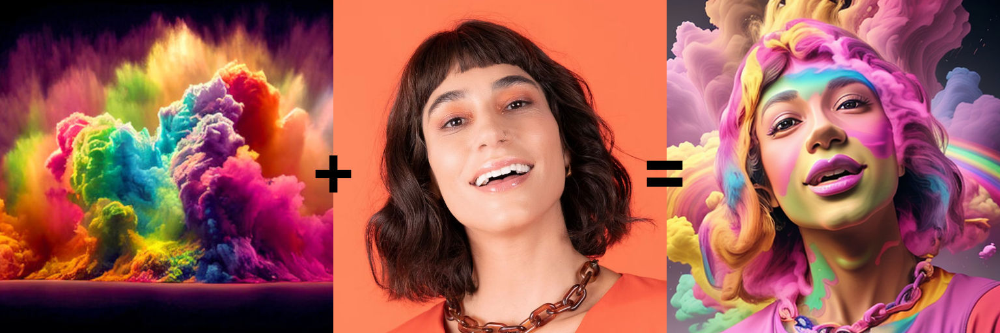

# ComfyUI_IPAdapter_Plus
ComfyUI reference implementation for [IPAdapter](https://github.com/tencent-ailab/IP-Adapter/tree/6fb9d3554a5c774f41e187e8fdbc7b9a1db8c2e3) models.

The code is mostly taken from the original IPAdapter repository and [laksjdjf's](https://github.com/laksjdjf/IPAdapter-ComfyUI/tree/main) implementation. I just made the extension closer to how ComfyUI makes things.

## Updates

**2023/9/11**: The code has been rewritten to take advantage of the new ComfyUI updates regarding clip vision. Expect lower memory usage.

## Example workflow

## Installation

Download or git clone this repository inside `ComfyUI/custom_nodes/` directory.

The pre-trained models are available on [huggingface](https://huggingface.co/h94/IP-Adapter), download and place them in the `ComfyUI/custom_nodes/ComfyUI_IPAdapter_plus/models` directory.

For SD1.5 you need:

- [ip-adapter_sd15.bin](https://huggingface.co/h94/IP-Adapter/resolve/main/models/ip-adapter_sd15.bin)
- [ip-adapter-plus_sd15.bin](https://huggingface.co/h94/IP-Adapter/resolve/main/models/ip-adapter-plus_sd15.bin)
- [ip-adapter-plus-face_sd15.bin](https://huggingface.co/h94/IP-Adapter/resolve/main/models/ip-adapter-plus-face_sd15.bin)

For SDXL you need:
- [ip-adapter_sdxl.bin](https://huggingface.co/h94/IP-Adapter/resolve/main/sdxl_models/ip-adapter_sdxl.bin)

Additionally you need the clip vision models:

- SD 1.5: [pytorch_model.bin](https://huggingface.co/h94/IP-Adapter/resolve/main/models/image_encoder/pytorch_model.bin)
- SDXL: [pytorch_model.bin](https://huggingface.co/h94/IP-Adapter/resolve/main/sdxl_models/image_encoder/pytorch_model.bin)

You can rename them to something easier to remember (eg: `ip-adapter_sd15-image-encoder.bin`) and place them under `ComfyUI/models/clip_vision/`.

## How to use

There's a basic workflow included in this repo and a few examples in the [example](./examples/) directory.

**IMPORTANT:** Remember to use the `CLIP Vision Encode (IPAdapter)` node (and not the standard one included with ComfyUI). Also be sure to **select the model of the same kind (1.5 vs XL)**, there are 3 of them: clip vision, IPApdapter and the main checkpoint.

### Samplers

Weirdly enough all **dpmpp_2m** (including _sde) samplers seem to perfom a little worse with IPAdapter and they generally need 5-10 more steps than usual. **ddmin** and **euler** seem to be pretty good.

### IPAdapter + Canny ControlNet

The model is very effective when paired with a ControlNet. In the example below I experimented with Canny. [The workflow](./examples/IPAdapter_Canny.json) is in the examples directory.

### IPAdapter Face

IPAdapter offers an interesting model for a kind of "face swap" effect. [The workflow is provided](./examples/face.json).

### Masking

Masking in img2img generally works but I find inpainting to be far more effective. The [inpainting workflow](./examples/inpainting.json) uses the face model together with an inpainting checkpoint.

**Important:** when masking the *IPAdapter Apply* node be sure that the mask is of the same size of the latent.