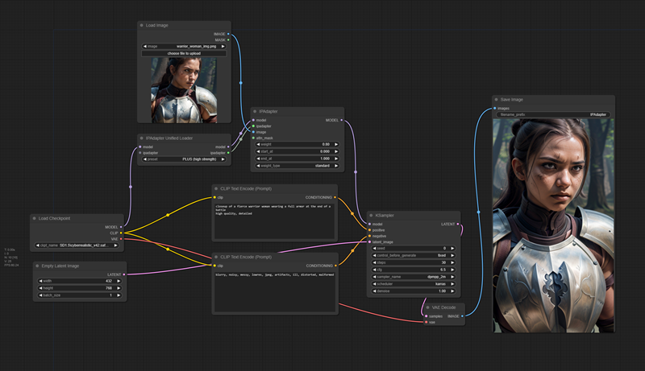
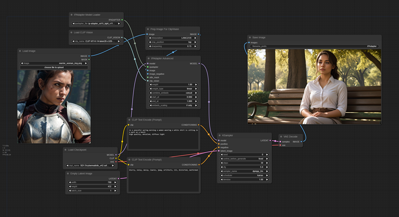

# User Guide

## Quick Start

Lorem ipsum dolor sit amet, consectetur adipiscing elit. In porttitor condimentum ullamcorper. Nullam mattis tellus ac quam commodo semper. Nullam posuere diam est, sit amet lacinia velit semper et. Proin eget lacinia dui. Nam aliquet porttitor mauris et aliquam. Proin vel egestas diam. Curabitur posuere aliquam porta.

## IP Adapter Simple

Cras convallis maximus euismod. Nullam id rutrum erat, id elementum purus. Pellentesque condimentum arcu id arcu sagittis blandit. Pellentesque euismod semper enim, nec faucibus velit hendrerit eu. Nam feugiat, tellus dignissim mollis vulputate, libero urna fermentum tortor, id ornare felis quam quis lectus. Aenean feugiat diam nisl, quis mattis turpis volutpat vel. Donec sagittis nunc tincidunt, varius elit vitae, venenatis leo. Aenean ac velit ut lectus dapibus cursus vel eget enim. Proin vel neque sit amet metus pellentesque efficitur. Mauris a lacinia elit, aliquet elementum ipsum. Nam vulputate, diam nec semper varius, neque quam interdum sapien, et commodo lorem tortor nec leo. Sed condimentum at lacus non interdum. Maecenas nec enim congue, molestie diam at, condimentum lorem. Sed porta erat vitae viverra vulputate. Curabitur sed mauris nec neque ullamcorper tempor.

## IP Adapter Advanced

Nullam sagittis convallis scelerisque. Donec dui erat, tristique nec iaculis et, hendrerit a turpis. Suspendisse velit ipsum, varius in augue a, porttitor accumsan tellus. Suspendisse erat tellus, tincidunt id ullamcorper pretium, feugiat sed quam. Nunc rutrum eros neque, vel suscipit erat tempus at. Phasellus eu hendrerit nunc, a lobortis diam. Proin a ex massa. Pellentesque quis ex lacinia nibh blandit sagittis at eget elit.

## IP Adapter Portrait (Style Transfer)

Duis dapibus, enim vitae elementum egestas, libero ex gravida mi, at luctus tellus mauris vel lorem. Nulla tristique consectetur arcu, at sagittis diam viverra vitae. Suspendisse potenti. Nulla id lacus fermentum felis maximus lobortis. Mauris egestas diam mi, eget interdum mauris varius eu. Orci varius natoque penatibus et magnis dis parturient montes, nascetur ridiculus mus. Aliquam erat volutpat. Vestibulum quis ex feugiat, cursus purus eget, commodo ligula. Vestibulum ante ipsum primis in faucibus orci luctus et ultrices posuere cubilia curae; Vestibulum at diam sit amet tellus dignissim viverra. Nulla placerat, sem sed tincidunt lobortis, quam turpis fermentum ligula, eu tincidunt ligula dolor non felis. Pellentesque erat quam, egestas sed lacinia venenatis, pulvinar quis justo. Etiam id pharetra urna. Curabitur tristique facilisis iaculis.

## Heading 1

Duis vulputate faucibus faucibus. Sed semper ornare ligula a rutrum. Mauris sit amet tempus nisi. Nunc venenatis id ipsum vitae ornare. Suspendisse rhoncus consectetur dolor, sit amet semper lectus aliquet placerat. Mauris lacus neque, lacinia a odio ac, fermentum mattis risus. Duis id egestas quam. Aliquam erat volutpat.

Duis laoreet blandit lacus at efficitur. Maecenas rutrum lorem sed mauris porta vulputate. Nullam imperdiet augue at nibh lacinia faucibus. Morbi vestibulum nulla quis eros suscipit, a tincidunt tellus feugiat. Cras ut egestas dolor, eget aliquam neque. Suspendisse ultrices iaculis commodo. Nulla in vestibulum enim. Pellentesque ac erat porttitor, maximus sem et, semper ex. Nullam molestie ante urna. Mauris non nisl velit. Donec facilisis nisl magna, ac scelerisque leo ornare at. Sed sed consequat arcu, non consequat ante.

## Heading 2

Donec efficitur metus id pulvinar volutpat. Praesent nec hendrerit ligula. Nulla eget nisl neque. In tempor volutpat feugiat. Fusce dignissim molestie sapien ut venenatis. Sed laoreet dui mi, ut dignissim velit ornare rutrum. Duis fermentum, orci a dapibus dictum, dolor urna cursus quam, non condimentum mauris erat vel turpis. Praesent ullamcorper mauris in laoreet finibus. Curabitur efficitur urna eget nibh interdum fermentum. Quisque in fermentum tellus. Nullam euismod nisl vitae lobortis posuere. Donec sollicitudin sem a commodo mattis. Vivamus at mi porta dolor tristique dignissim a et elit.

Pellentesque libero augue, maximus vitae nibh in, lobortis porta tellus. Aliquam suscipit, augue ut faucibus rhoncus, nunc massa condimentum purus, eu vulputate arcu arcu vitae turpis. Ut a ante nec purus finibus posuere ac eget lectus. Etiam cursus vulputate semper. Sed congue tellus vel mollis suscipit. Duis pretium libero nec lorem elementum, in tempor risus mollis. In sed dolor nulla.

Nullam gravida feugiat felis, in placerat turpis porta vel. Integer commodo posuere feugiat. Curabitur egestas ut dui vel sagittis. Donec quis ante ut est bibendum vestibulum ut vel elit. Vestibulum ante ipsum primis in faucibus orci luctus et ultrices posuere cubilia curae; Suspendisse vel semper felis. Fusce id felis sit amet nibh vulputate volutpat.

Curabitur ornare, felis eu bibendum suscipit, neque lorem aliquam ante, at molestie lacus libero rhoncus odio. Nullam eu nisi faucibus, auctor elit interdum, mattis odio. Aenean sagittis luctus dolor in efficitur. Pellentesque quis enim accumsan, venenatis lectus in, feugiat massa. Aenean eleifend justo neque, vel interdum leo dictum ac. Aliquam et orci vel augue placerat condimentum nec eu nisl. In vehicula ac arcu ut vehicula. Praesent accumsan lacus orci, non suscipit nibh sodales gravida. Duis ultricies porttitor porta.
