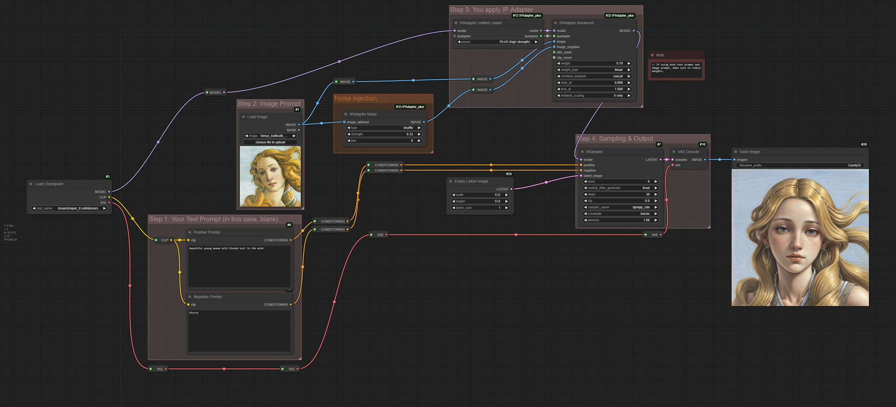
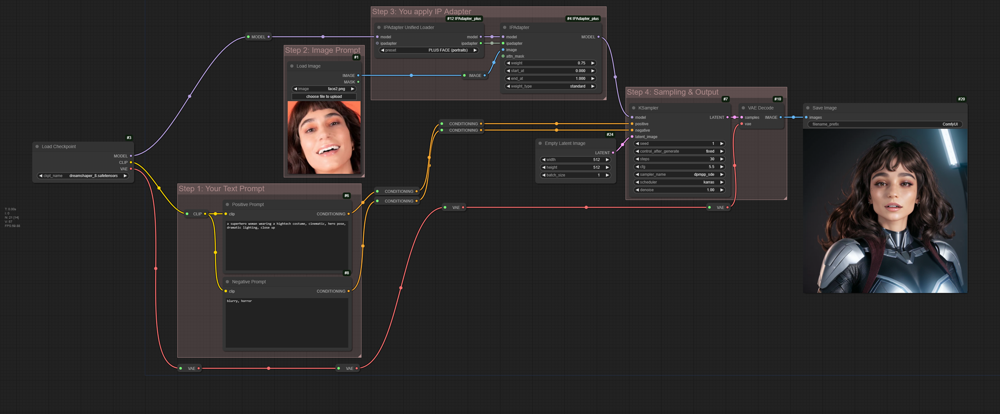
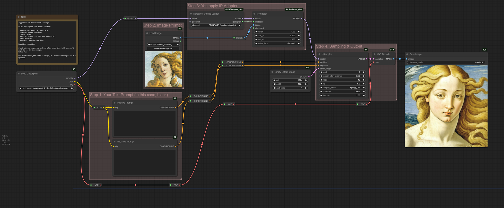
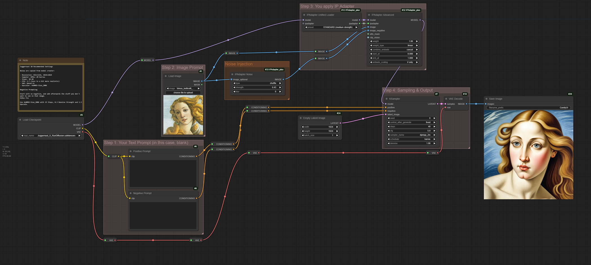
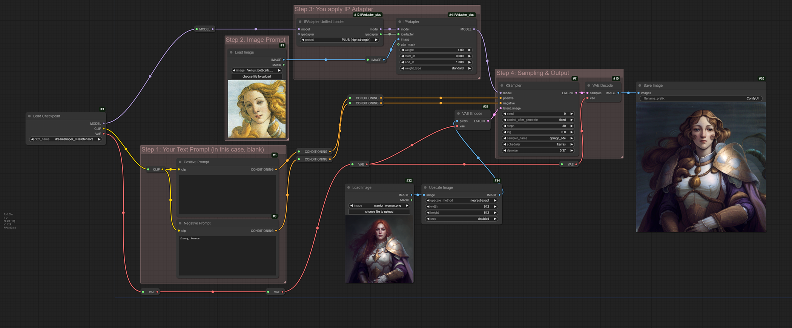
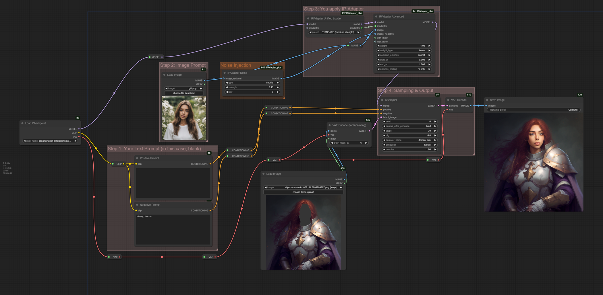

# IP Adapter User Guide

Welcome to IP Adapter User Guide. Please note that this guide is very much work in progress at this stage.

- [1. Quick Start](#1-quick-start)
  - [1.1 Before You Begin](#11-before-you-begin)
  - [1.2 Stable Diffusion 1.5](#12-stable-diffusion-15)
    - [1.2.1 Image-Only Prompts](#121-image-only-prompts)
    - [1.2.2 Noise Injection](#122-noise-injection)
  - [1.3 Multimodal Input](#13-multimodal-input)
  - [1.4 Nonsquare Reference](#14-nonsquare-reference)
  - [1.5 Multi-Image Input](#15-multi-image-input)
  - [1.6 Plus Face Model](#16-plus-face-model)
  - [1.7 SDXL Models](#17-sdxl-models)
  - [1.8 Image-To-Image](#18-image-to-image)
  - [1.9 Inpainting with IP Adapter](#19-inpainting-with-ip-adapter)
- [2. IP Adapter: Advanced Guide](#2-ip-adapter-advanced-guide)
- [3. Models Reference Table](#3-models-reference-table)

# 1. Quick Start

Anyone completely new to this should watch [How to use IPAdapter models in ComfyUI](https://www.youtube.com/watch?v=7m9ZZFU3HWo) on YouTube, by Matteo Spinelli.

> **IMPORTANT** As of this writing, over a year has passed since the video got published, and in that time IP Adapter nodes have undergone several major updates. For a number of reasons, including the changes in how the weights are calculated, reproducing exact outcomes as shown in the video are no longer possible.

Below are the adapted workflows in more-or-less chronological order, which you can load into ComfyUI via drag-and-drop.

## 1.1 Before You Begin

To begin, you will need to:

- Use Node Manager to download IP Adapter models (avoid depricated ones)
- Download two ClipVision models using the same

Optionally, if you wish to reproduce exact results as shown in workflows, you may wish to:

- Download Lycon's Dreamshaper 8 checkpoint from Civitai (download [link](https://civitai.com/api/download/models/128713?type=Model&format=SafeTensor&size=pruned&fp=fp16)) and place the safetensor file in `~/ComfyUI/models/checkpoints`.
- Download input images (download [link](assets/input_images.zip)) and place them in `~/ComfyUI/input`.

Alternatively, you are welcome to use checkpoint and inputs of your choosing.

You can drag-and-drop each workflow <u>directly from this page</u>, and ComfyUI will load it. However, should you wish to save them on your computer, you can download [workflows.zip](assets/workflows.zip).

## 1.2 Stable Diffusion 1.5

### 1.2.1 Image-Only Prompts

Given that 'IP' in 'IP Adapter' stands for **I**mage **P**rompt, prompting using images is a reasonable place to start.

Each adapter model must be matched with the corresponding ClipVision model (ViT-H/BigG), and and used with the correct checkpoint (SD1.5/SDXL). Detailed matchup is shown at the bottom of this document. However, IP Adapter now has **Unified Loader**, which automatically loads the correct ClipVision model.

Below workflows show the use of reference image as a replacement for text prompt using 'standard' and 'plus' models. Note that 'Plus' model is stronger and will have greated impact on the output compared to regular one; whereas standard model describes reference image using only 4 tokens, Plus model uses 16 tokens.

**Workflow with 'Standard' model:**

**Workflow with 'Plus' model:**

### 1.2.2 Noise Injection

**Workflow with 'Standard' model:**

If **Apply IPAdapter** is no longer available, how are we to inject noise?

**Answer**: we use a node called **IPAdapter Noise**.

IP Adapter now has a dedicated node for noise injection. However, if you wish to replicate noise injection that was previously available via **Apply IPAdapter** node, load IPAdapter Noise, connect it to the reference image and choose 'shuffle'. See below workflows.

**Workflow with 'Plus' model:**

## 1.3 Multimodal Input

If prompting with both image and text, weights on IP Adapter need to be reduced, as below workflows show.

**Workflow with 'Standard' model:**

**Workflow with 'Plus' model:**

## 1.4 Nonsquare Reference

If you are using nonsquare image as your input, CLIP image processor will make it a square by cropping it at the center.

This is fine, if the centre of the image is the focus. For portraits of people, this will likely give unexpected results:

Unless, of course this is what you want, we need a way to tell ClipVision 'Hey! Eyes up here!'

You can accomplish that using **Prep Image for ClipVision** node with `crop_position` set to `Top`:

You can, of course, crop the image manually into a square. The only alternative is to outpaint image sides until it is a square image. Either way, ClipVision will receive a square image in the end.

## 1.5 Multi-Image Input

You can use IP Adapter to make multiple images serve as input

## 1.6 Plus Face Model

## 1.7 SDXL Models

SDXL 'Standard':

SDXL 'Standard' with noise injection:

## 1.8 Image-To-Image

## 1.9 Inpainting with IP Adapter

# 2. IP Adapter: Advanced Guide

(To be continued...)

# 3. Models Reference Table

Below tables show the matching of models with visual transformers, checkpoints and/or LoRAs.

**IP Adapter with SD1.5**

| IP Adapter                            | Matching Visual Transformer (ViT)              | Alias[^1]         |
| ------------------------------------- | ---------------------------------------------- | ----------------- |
| ip-adapter_sd15.safetensors           | CLIP-ViT-H-14-laion2B-s32B-b79K.safetensors    | STANDARD          |
| ip-adapter_sd15_light_v11.bin[^2]     | CLIP-ViT-H-14-laion2B-s32B-b79K.safetensors    | LIGHT - SD15 Only |
| ip-adapter_sd15_vit-G.safetensors     | CLIP-ViT-bigG-14-laion2B-39B-b160k.safetensors | VIT-G             |
| ip-adapter-plus_sd15.safetensors      | CLIP-ViT-H-14-laion2B-s32B-b79K.safetensors    | PLUS              |
| ip-adapter-plus-face_sd15.safetensors | CLIP-ViT-H-14-laion2B-s32B-b79K.safetensors    | PLUS FACE         |

**IP Adapter with SDXL**

| IP Adapter                                  | Matching Visual Transformer (ViT)              | Alias[^1] |
| ------------------------------------------- | ---------------------------------------------- | --------- |
| ip-adapter_sdxl.safetensors                 | CLIP-ViT-bigG-14-laion2B-39B-b160k.safetensors | STANDARD  |
| ip-adapter_sdxl_vit-h.safetensors           | CLIP-ViT-H-14-laion2B-s32B-b79K.safetensors    | VIT-G     |
| ip-adapter-plus_sdxl_vit-h.safetensors      | CLIP-ViT-H-14-laion2B-s32B-b79K.safetensors    | PLUS      |
| ip-adapter-plus-face_sdxl_vit-h.safetensors | CLIP-ViT-H-14-laion2B-s32B-b79K.safetensors    | PLUS FACE |

**FaceID with SD1.5**

| IP Adapter                              | Matching Visual Transformer (ViT)           | LoRA                                           | Alias[^1]       |
| --------------------------------------- | ------------------------------------------- | ---------------------------------------------- | --------------- |
| ip-adapter-faceid_sd15.bin              | CLIP-ViT-H-14-laion2B-s32B-b79K.safetensors | ip-adapter-faceid_sd15_lora.safetensors        | FACEID          |
| ip-adapter-faceid-plusv2_sd15.bin       | CLIP-ViT-H-14-laion2B-s32B-b79K.safetensors | ip-adapter-faceid-plusv2_sd15_lora.safetensors | FACEID PLUS V2  |
| ip-adapter-faceid-portrait-v11_sd15.bin | CLIP-ViT-H-14-laion2B-s32B-b79K.safetensors | None                                           | FACEID PORTRAIT |

**FaceID with SDXL**

| IP Adapter                          | Matching Visual Transformer (ViT)           | LoRA                                           | Alias[^1]       |
| ----------------------------------- | ------------------------------------------- | ---------------------------------------------- | --------------- |
| ip-adapter-faceid_sdxl.bin          | CLIP-ViT-H-14-laion2B-s32B-b79K.safetensors | ip-adapter-faceid_sdxl_lora.safetensors        | FACEID          |
| ip-adapter-faceid-plusv2_sdxl.bin   | CLIP-ViT-H-14-laion2B-s32B-b79K.safetensors | ip-adapter-faceid-plusv2_sdxl_lora.safetensors | FACEID PLUS V2  |
| ip-adapter-faceid-portrait_sdxl.bin | CLIP-ViT-H-14-laion2B-s32B-b79K.safetensors | None                                           | FACEID PORTRAIT |

[^1]: When using Unified Loader
[^2]: Version 1 (`ip-adapter_sd15_light.safetensors`) is depricated. You need version v1.1.

**Community Models**

| IP Adapter                                 | Matching Visual Transformer (ViT)           | LoRA | Alias[^1]                          |
| ------------------------------------------ | ------------------------------------------- | ---- | ---------------------------------- |
| ip-adapter-faceid-portrait_sdxl_unnorm.bin | CLIP-ViT-H-14-laion2B-s32B-b79K.safetensors | None | FACEID PORTRAIT UNNORM - SDXL Only |

(to be continued)
